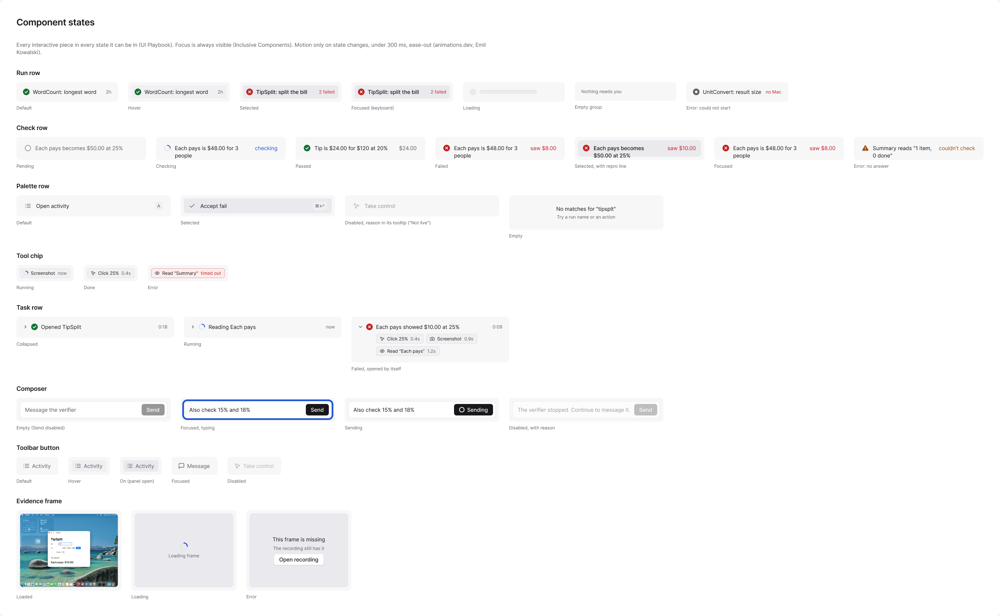
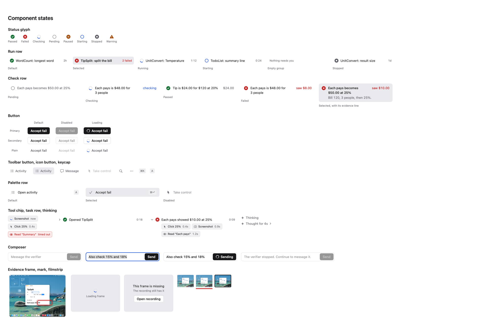
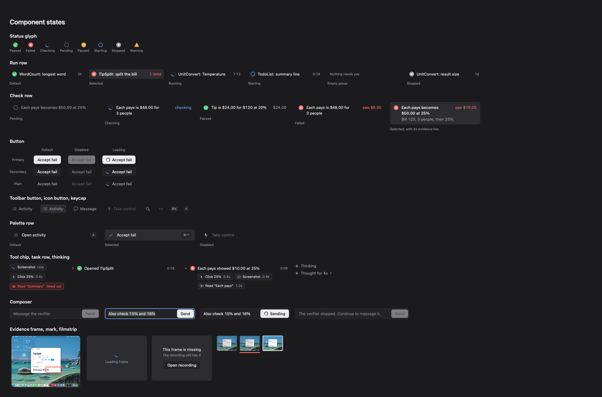

# The native redesign beside its Figma design

Renders from the snapshot harness (`GREENROOM_REDESIGN_SNAPSHOTS=<dir>
.build/out/Products/Debug/CompanionSnapshots`, companion ADR 0019) next to the Figma exports
they are built from (file 041UmqtdMYVCufxO8g9Ius). The Figma frames are drawn in Inter; the
app draws in SF Pro at the same sizes, so text runs slightly narrower. Each section says what
still differs.

## Components

| Figma (Components, "Component states") | App, light | App, dark |
| --- | --- | --- |
|  |  |  |

Every component and state of the Figma board renders: the eight status glyphs, the run row
(default, selected, running, starting, empty group, stopped), the check row (pending,
checking, passed with the value it read, failed with "saw", selected with its evidence
line), buttons (primary, secondary, plain x default, disabled, loading), the toolbar button
(default, on, disabled), icon buttons, keycaps, palette rows (default, selected, disabled),
tool chips (running, done, error), task rows (collapsed, opened by itself), Thinking (live,
done), the composer (empty, typing, sending, disabled with its reason) and the evidence
frame (loaded with its mark, loading, missing) with filmstrip thumbs (default, failed,
selected). Hover, pressed and focused states are interactive and do not show on a still.

Differences from the file: icons are SF Symbols (the file uses Lucide, which the native app
does not ship); the frame shown is a real TipSplit screenshot, so the gallery's mark sits
where the fixture says, not over this picture's value.
