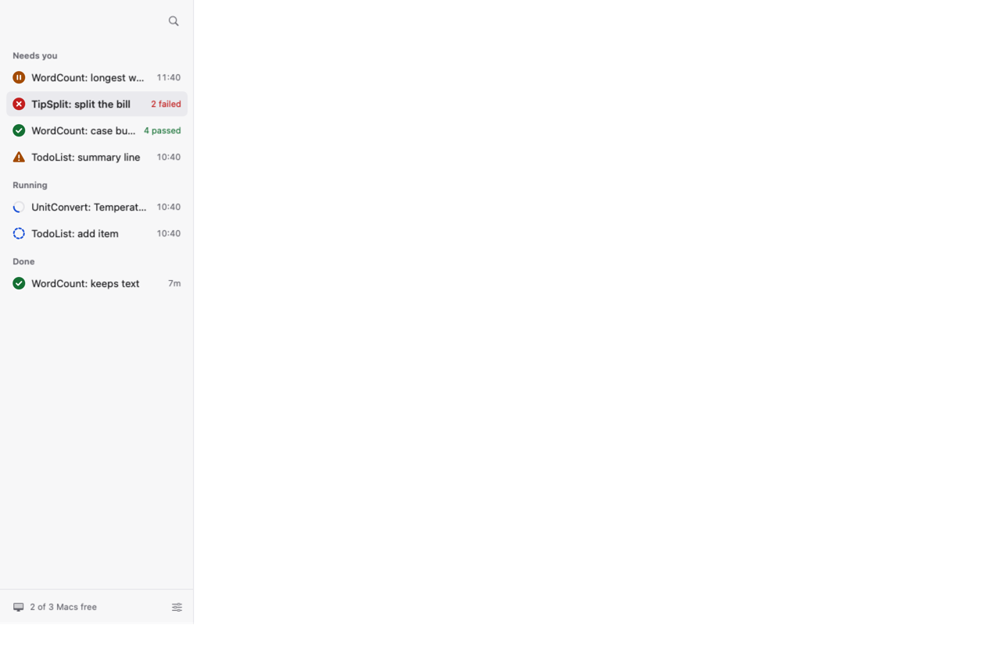
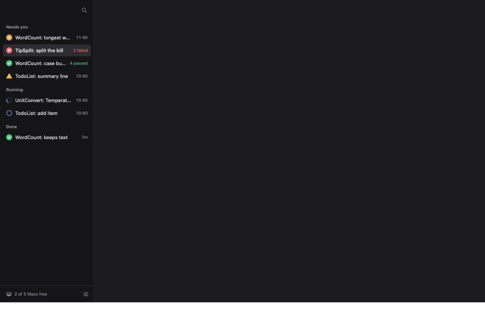
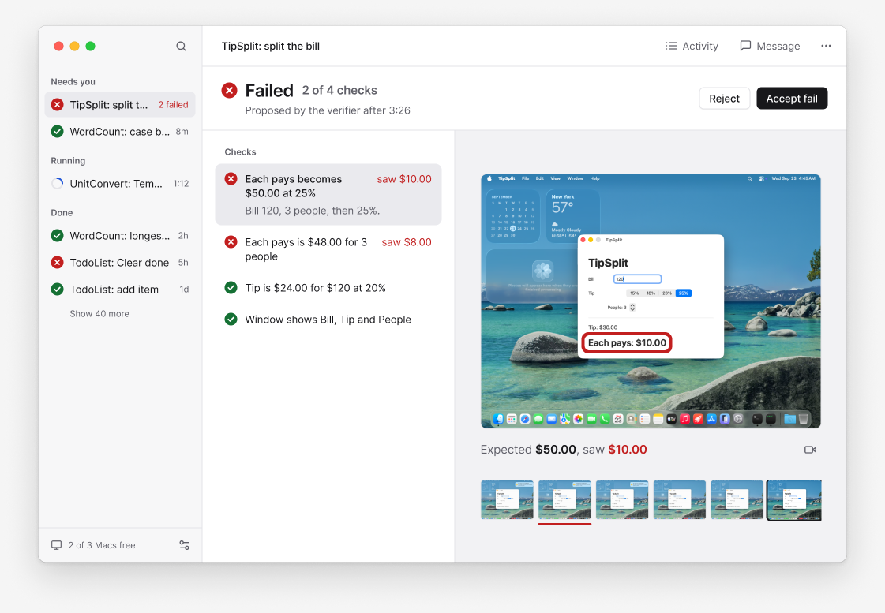
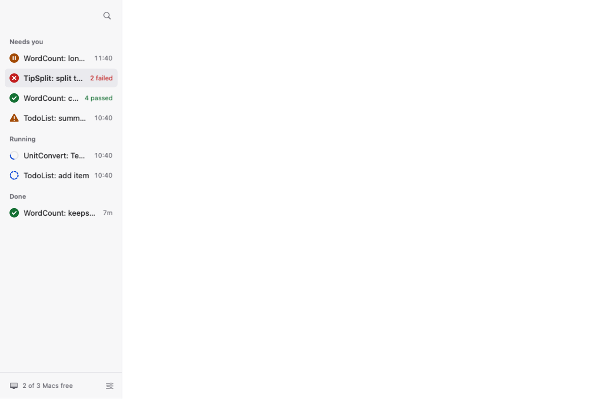
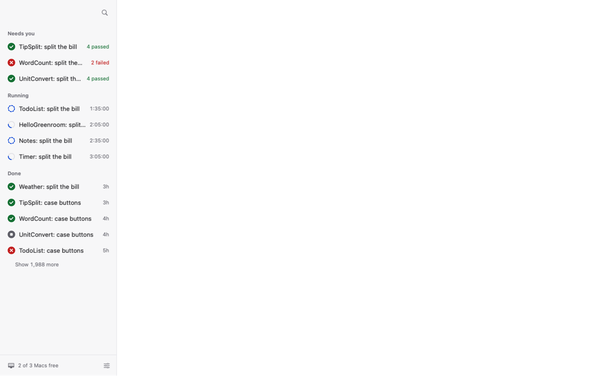
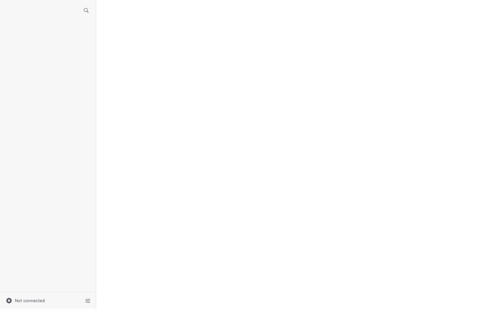

# The native redesign beside its Figma design

Renders from the snapshot harness (`GREENROOM_REDESIGN_SNAPSHOTS=<dir>
.build/out/Products/Debug/CompanionSnapshots`, companion ADR 0019) next to the Figma exports
they are built from (file 041UmqtdMYVCufxO8g9Ius). The Figma frames are drawn in Inter; the
app draws in SF Pro at the same sizes, so text runs slightly narrower. Each section says what
still differs.

## Components

| Figma (Components, "Component states") | App, light | App, dark |
| --- | --- | --- |
|  |  |  |

Every component and state of the Figma board renders: the eight status glyphs, the run row
(default, selected, running, starting, empty group, stopped), the check row (pending,
checking, passed with the value it read, failed with "saw", selected with its evidence
line), buttons (primary, secondary, plain x default, disabled, loading), the toolbar button
(default, on, disabled), icon buttons, keycaps, palette rows (default, selected, disabled),
tool chips (running, done, error), task rows (collapsed, opened by itself), Thinking (live,
done), the composer (empty, typing, sending, disabled with its reason) and the evidence
frame (loaded with its mark, loading, missing) with filmstrip thumbs (default, failed,
selected). Hover, pressed and focused states are interactive and do not show on a still.

Differences from the file: icons are SF Symbols (the file uses Lucide, which the native app
does not ship); the frame shown is a real TipSplit screenshot, so the gallery's mark sits
where the fixture says, not over this picture's value.

## Runs sidebar

| Figma (03, failed; the sidebar column) | App, light, 1280 x 800 | App, dark |
| --- | --- | --- |
|  |  |  |

| Figma compact (1024 x 680) | App, 1024 x 680 | App, 2,000 runs | App, not connected |
| --- | --- | --- | --- |
|  |  |  |  |

The rows are the daemon's golden board (the runs the Figma screens show), so names and
groups match the file; metas are worked out from the board's own clock. Visible words, read
back by the text recogniser: 39 for the seven-run sidebar (about five a row with the headings
and footer), 68 for 2,000 runs (the list shows 13 rows, Done folded behind "Show 1,988 more").

Performance (`SidebarPerformanceTests`, 2,000 runs with Done expanded, this Mac): the first
layout of the list takes 129 ms and a scroll step (scroll, layout, draw) 3.7 ms median, 5.6 ms
p95. The first version, a SwiftUI `List`, measured every row: 2,765 ms to lay out and 31 ms
median, 578 ms p95 per step; the list is now an `NSTableView` with fixed row heights
(`RunsTable`).
