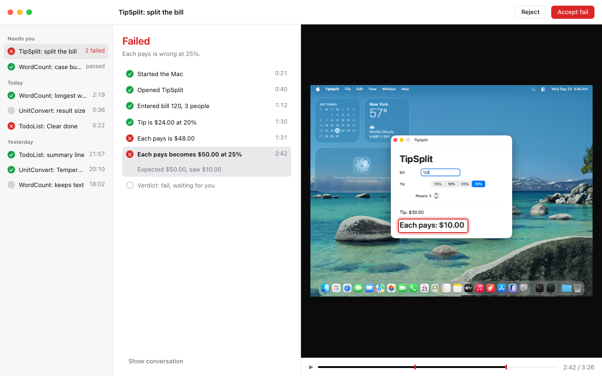
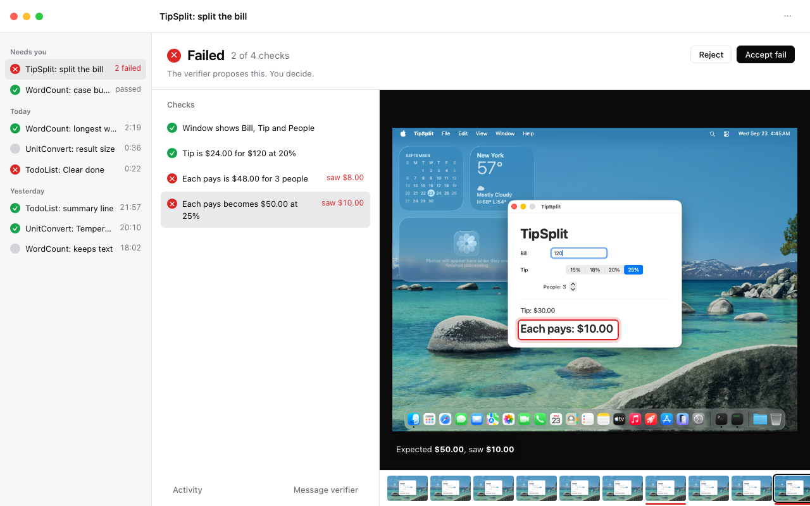
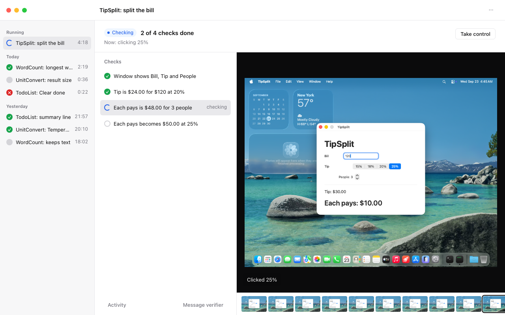
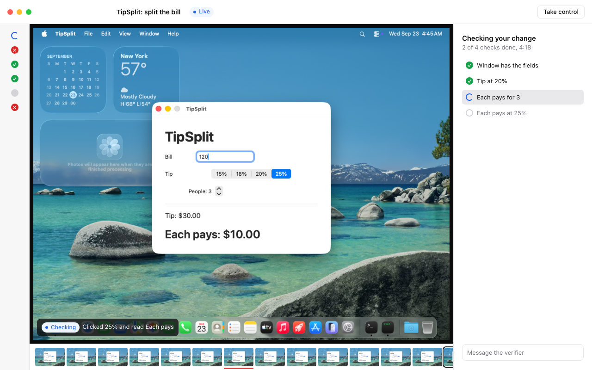
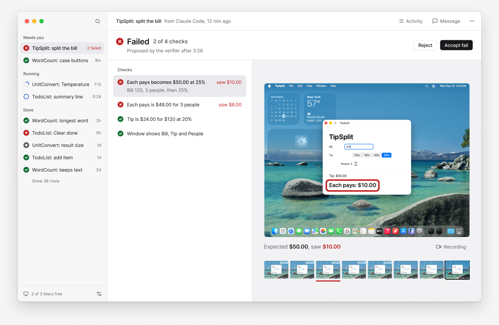
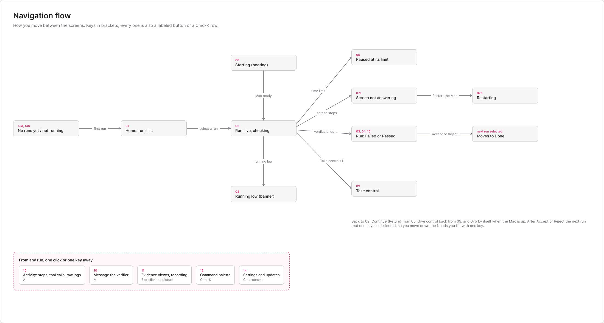

# 20. Companion UX research and redesign plan

Date: 2026-09-27. Status: research, for a decision. Nothing here changes code.

The person who uses the Companion every day said: "there is too much text on the screen,
a user genuinely has no clue what is going on, it is too confusing and too AI coded". They
also said the agreed glyph, terminal and olive direction (companion ADRs 0004 to 0008,
`apps/companion/docs/design-spec.md`) is not working. This note starts from a clean slate:
it reads the current window as evidence, measures it, checks it against the design
literature and against products that show automated work well, and proposes what to build
instead. Every existing design decision is open, including type, colour, layout, the
interaction model and the UI technology.

Contents:

1. How the audit was done
2. The root problems (the headline)
3. Screen by screen audit
4. Principles we adopt
5. What the reference products teach
6. The text budget
7. The five-second questions and where each is answered
8. Three redesign directions, and the recommendation
9. The technology: a web UI in a thin native shell, or native SwiftUI
10. Phased implementation plan
11. Sources
12. Wireframes and mockups (Figma)

## 1. How the audit was done

- **Pictures.** The repo's snapshot harness (`apps/companion/Sources/CompanionSnapshots`)
  renders the real window, but it needs a daemon serving copied runs. Starting a scratch
  daemon was not allowed during this research (a stress test is using the machines), so
  the audit uses the harness's most recent full render, made on 2026-09-26 at 05:46 from
  `main` (all scenarios 01 to 45, light and dark, sizes L, M, S and G), plus the top bar
  and More menu rendered on 2026-09-26 at 23:04 after companion ADR 0017. Nineteen
  Companion commits have landed since the full render (the More menu, twins in the runs
  list, the stopped-verifier card, Done). They add to the window; none of them removes
  text or a region, so the measurements below are a floor, not a ceiling. The stopped
  (46) and finished (52 to 54) scenarios are read from their ADRs (0015, 0016).
- **Kept copies.** The fourteen most telling shots are in
  [`20-companion-ux-research/before/`](20-companion-ux-research/before/) (L shots
  downscaled to 1180 px wide).
- **Word counts.** Every shot was run through Apple's Vision text recogniser
  ([`tools/wordcount.swift`](20-companion-ux-research/tools/wordcount.swift):
  `swiftc -O wordcount.swift -o wc && ./wc shot.png` prints lines, words, characters).
  The count includes text inside the guest's own screen (the TipSplit window, the
  calendar widget), about 40 words per shot; the "chrome words" column subtracts it.
- **Styles and colours.** Counted from the code (`Design/Typography.swift`,
  `design/tokens.json`, `design/themes/*.json`) and by eye on the shots.
- **Design skills.** The audit applies the anti-"AI slop" checklists of five design
  skills installed for Claude (Hallmark's anti-pattern list and audit verb,
  redesign-existing-projects, design-taste-frontend, minimalist-ui,
  high-end-visual-design). They are written for web pages; section 4 says which rules
  translate to a native Mac window and which do not, and each finding names the rule
  that drove it.

## 2. The root problems

Seven root problems explain almost everything the person reported. Each names the shot
that shows it best and the principle it breaks.

| # | Problem | Best evidence | Principle it breaks |
| --- | --- | --- | --- |
| 1 | **No single answer to "did it pass?"** The outcome is split across up to seven phrases in three regions ("Ended", "The verdict needs review", `! UNREVIEWED`, `PASS`, "! No person reviewed it", "Verdict: Pass unreviewed, in full above", "Coding agent accepted the pass verdict"). The verdict lives in a card in the right column, below a "Conversation" heading. | `01-finished-agent-accepted-dark-L`, `05-verdict-proposed-light-M` | NN/g heuristic 1, visibility of system status; Krug's first law (self-evident); Refactoring UI "not everything can be important" |
| 2 | **Walls of prose that were written for machines.** The agent's task (80 to 120 words of instructions to the verifier, including "Record your verdict by calling the report_verdict tool, not as text") is shown three times: as the title, as the subtitle and in the transcript. Verdict reasons run 60 to 80 words. | `08-live-verifier-working-light-M`, `07-verdict-contested-light-M` | Krug, "omit needless words" and "get rid of half the words, then half of what is left"; Nielsen heuristic 8 (aesthetic and minimalist design); design-taste-frontend 4.9 (copy self-audit, content density) |
| 3 | **One timeline drawn four times, none of them readable.** The steps appear as the scrubber's ticks, the one-row "68 STEPS" track, the "All Steps" list and the tool-call rows in the conversation. Each row names a mechanism ("Took a screenshot" five times on one screen, "Clicked at 75%, 45%", step numbers and milliseconds), not what was learned. | `08-live-verifier-working-light-M`, `03-steps-failure-dark-M` | Tufte, erase redundant data-ink; Refactoring UI, "labels are a last resort"; NN/g information scent |
| 4 | **Too many things compete for the eye.** A live run has about nine focal points of similar weight (title, red "6 steps errored" chip, Take Control, the screen, the red-ticked scrubber, the step track, the verdict bar, the transcript, the yellow `!` strip) plus an always-on hint bar of ten key hints. | `08-live-verifier-working-light-M`, `10-driving-dark-M` | Hick's law; NN/g F-pattern (the top-left and the first lines get read, the rest is skimmed); HIG, one prominent action per view |
| 5 | **Jargon and internals on the default view.** `greenroom-base-tcc`, `machine_ui`, `UI read 33`, "Step Record", "superseded", "contested", "unreviewed", `tart exec ...: context deadline exceeded`, "recording 1:57 of 26:45", tool durations in ms. | `03-steps-failure-dark-M`, `41-real-four-checks-fail-dark-G`, `36-moment-verdict-landed-fail-light-M` | Nielsen heuristic 2 (match the real world); Norman's gulf of evaluation; Tesler's law (the system, not the person, absorbs the complexity) |
| 6 | **"Needs you" means nothing.** 136 of 179 runs sit under "NEEDS YOU", each tagged `! Pass, needs review` or `! Fail, needs review` in yellow; the folded sidebar is a column of twenty unlabeled yellow `!` glyphs. When everything is urgent, nothing is. | `14-many-runs-light-L`, `15-no-selection-dark-M`, `08-live-verifier-working-light-M` (left strip) | NN/g, visibility of status (status must be accurate to be trusted); Vercel Geist status dot (state name alone, colour only for real state); design-taste-frontend 9.F (decorative status marks) |
| 7 | **The look reads as generated.** A terminal costume on a Mac app: a blinking block cursor after the wordmark, uppercase mono labels over every region (`SCREEN`, `16 STEPS`, `NEEDS YOU`, `PLAN: 12 CHECKS`, `CONNECT YOUR AGENT`), middle-dot metadata strips (`Live · Verifier working · last step 13s ago (Screenshot) · running 31:30 · 68 steps`), cards inside cards, coloured side stripes on every message group, Title Case buttons, a menu the app redraws itself instead of the system menu, and about twenty distinct text treatments on one screen. | all shots, `55-more-live-dark-M` | Hallmark: "Eyebrow on every section", "Card-in-card", "The side-stripe card", "Re-drawn UI chrome", "Default-attractor sameness"; design-taste-frontend 9.F (middle dot rationed to one per line, section-label eyebrows); redesign-existing-projects (all-caps subheaders, Title Case headers, more than one accent) |

A cross-cutting eighth problem is a consequence of the seven: **the next action is not
obvious.** The primary button moves (Take Control top right when live, Accept inside the
card when proposed), a message composer is always open even when nothing will answer
("The verifier stopped with the machine. Nothing will answer."), and the stopped-verifier
state reads as one more message in the transcript while the header still says "Verifier
working" (`08-live-verifier-working-light-M`: the last verifier message is "This turn ran
out of time after 10m0s").

## 3. Screen by screen audit

Measured on the M size (1180 x 760) unless the name says L (1440 x 900) or G (1024 x 660).

| Shot | State | Words on screen | Chrome words (minus guest screen) | Text lines | Focal points |
| --- | --- | ---: | ---: | ---: | ---: |
| `08-live-verifier-working-light-M` | live, verifier working | 337 | about 295 | 75 | 9 |
| `09-live-idle-light-M` | live, idle | 337 | about 295 | 73 | 9 |
| `10-driving-dark-M` | you have control | 311 | about 270 | 73 | 10 |
| `40-checks-plan-live-dark-M` | live, plan of 12 checks | 327 | about 285 | 84 | 9 |
| `11-booting-dark-M` | booting | 134 | 134 | 46 | 5 |
| `05-verdict-proposed-light-M` | pass, needs review | 321 | about 280 | 72 | 8 |
| `07-verdict-contested-light-M` | contested | 277 | about 237 | 67 | 8 |
| `36-moment-verdict-landed-fail-light-M` | fail, live, step open | 294 | about 250 | 81 | 10 |
| `41-real-four-checks-fail-dark-G` | fail, four checks | 265 | about 235 | 67 | 8 |
| `01-finished-agent-accepted-dark-L` | finished, agent accepted | 496 | about 450 | 126 | 9 |
| `14-many-runs-light-L` | runs list, 138 waiting | 492 | about 450 | 118 | 9 |
| `15-no-selection-dark-M` | no run open | 174 | 174 | 51 | 3 |
| `18-welcome-light-M` | first launch | 131 | 131 | 26 | 3 |
| `55-more-live-dark-M` | More menu open | 250 | about 210 | 75 | 9 |

For scale: a finished run window of the recommended direction below carries about 60
words, and the mockups in section 8 were drawn to that budget.

**Type, colour and chrome, counted.**

- Type: two bundled families (Monaspace Neon, Mona Sans and its Expanded cut) in eleven
  cuts and eight point sizes (10, 10.5, 11.5, 12, 13, 14.5, 17 and the system face for
  marks); `TypeScale.monoSmall` alone is used 75 times. Mono and proportional sit on the
  same row (the status line, the verdict card, the transcript headers). About twenty
  distinct text treatments show on one live screen (uppercase mono label, mono dim meta,
  mono bold verdict, reading prose, reading small dim, expanded heading, sender label,
  key hint bold plus label dim, and so on).
- Colour: an ANSI palette of 16 slots, six semantic roles (failure, pass, attention, live,
  driving, dim) plus brand, brand text and chrome tint, plus a sender colour on each
  message group's left edge. A live screen shows seven hues at once (olive, cyan, red,
  yellow, magenta when driving, the sender edges, grey).
- Chrome: bordered regions nest three deep (window, conversation column, verdict card,
  tool-call group, tool-call row). The hint bar is always on, with ten entries.

**Per screen, what a first-time user cannot answer in five seconds.**

- **Live run (08, 09, 40).** Is it working? The header says "Verifier working", the
  screen says "connecting", the last verifier message says it ran out of time, and the
  red "6 steps errored" chip says something broke. What is it doing? "Took a screenshot"
  (the same words five times). Did my change pass? "No verdict. The verifier proposes one
  after it checks the ta..." (truncated). What do I do? Take Control, a composer, or
  nothing: the window does not say. The plan of checks (40), the one list that would say
  what is being checked, sits in the transcript below the fold of its own card.
- **Verdict proposed or contested (05, 07, 36, 41).** The window does say PASS or FAIL,
  but in a 20 pt mono word inside a card in the right third, under two lines of labels and
  above 60 to 80 words of reason and a paragraph explaining what Accept and Reject do.
  The contested card adds a dispute history in mono. The screen on the left shows the
  cited step, which is right, but nothing on it says where to look unless the check has an
  evidence mark (0014).
- **Finished (01).** Seven phrases about who decided what and whether a person
  reviewed it. "Ask for a Re-check..." is shown disabled next to a sentence explaining why.
- **Booting (11).** The best screen in the app: one job, a list of stages with times.
  It still shows `clone`, `ip 192.168.64.12`, `key installed` and a 35-character machine
  name, which only matter when boot fails.
- **Runs list (14, 15).** Titles are the first sentence of the agent's task, so they are
  long, truncated and near-duplicates ("WordCount has UPPERCASE and lowercase buttons
  that change the tex..." three times). Every waiting row repeats `! ..., needs review`.
- **First launch (18).** Good bones (one command to copy), but eleven lines of
  explanation compete with it, and "WHAT YOU CAN DO" lists four features instead of
  showing the one next step.

**What is already right and must survive.** One derived run state (companion ADR 0002);
the verdict as a list of checks with named evidence (0011); evidence marks on the
picture (0014); one primary action (0013); the stopped verifier as a state with Continue
(0015); only Verified is green (0016). The failures are of presentation, not of the model
underneath: the facts the window needs already exist in `RunFacts`, `VerdictReview` and
the checks.

## 4. Principles we adopt

Each is short enough to check against a snapshot. Sources are in section 11.

1. **Answer first, detail on request.** The top-left of the run window answers "did it
   pass?" (or "what is it doing now?") in three words or fewer. Everything else is one
   click away. (NN/g progressive disclosure; F-pattern; GitHub Actions' collapsed steps
   with the failure auto-expanded.)
2. **Status is a word plus a shape plus a colour, and it is true.** One of: Starting,
   Checking, Waiting for you, Paused, Passed, Failed, Stopped. Colour only when the state
   is real; no colour for "nothing to say". (NN/g heuristic 1; Vercel Geist status dot:
   the state name alone, never "Status: Ready"; HIG color: never colour alone.)
3. **Show what was learned, not what was done.** A step row says "Tip is $24.00 at 20%",
   not "Took a screenshot". Mechanisms (clicks, screenshots, tool names, milliseconds)
   live in Activity. (Refactoring UI, labels are a last resort; NN/g information scent.)
4. **Every claim sits next to its proof.** Select a check, see its frame with the mark on
   it and "Expected X, saw Y". (Playwright trace viewer's before/after snapshots; Xcode's
   failure beside the recording; companion ADRs 0011 and 0014.)
5. **One primary action per state, in the same place.** Accept or Continue or Take
   control, top right of the run header, and nothing else prominent. (HIG buttons;
   Raycast's primary action on Return; companion ADR 0013.)
6. **Say it once.** No fact appears in two places on the default view: one step count,
   one task title, one verdict. (Tufte, redundant data-ink; Krug.)
7. **The Mac already has chrome; use it.** System font, system menus, standard sidebar,
   keys in menus and a palette instead of an always-on hint bar. (HIG typography, menus
   and sidebars; Hallmark "Re-drawn UI chrome"; Things 3.) If the UI moves to web
   technology (section 9) the same rule holds: one type family, one neutral scale, one
   accent, platform-looking controls.
8. **Titles are names, not instructions.** A run's name is five words or fewer
   ("TipSplit: split the bill"), made by the daemon or the coding agent, never the first
   sentence of a prompt. (Krug; NN/g scanning.)
9. **Feedback within 0.1 s, progress within 1 s, a reason within 10 s.** Every wait
   longer than a second shows what it waits for; nothing sits on "connecting". (NN/g
   response-time limits; Doherty threshold; NN/g progress indicators.)
10. **Budget the words and test the budget.** Section 6 sets a ceiling per screen; the
    snapshot harness checks it. (Krug's halving rule made measurable.)

**Where the web design skills do not apply to a native window.** Rules about heroes,
landing-page sections, scroll-triggered entry animation, logo walls, pill CTAs with
nested icons, double-bezel cards, grain overlays and mobile breakpoints (Hallmark
macrostructures, high-end-visual-design sections 3 to 5, design-taste-frontend 4.7 and
4.8, minimalist-ui section 7) are for marketing pages and are ignored. Their bans on
eyebrows, card-in-card, side stripes, re-drawn chrome, decorative status dots, middle-dot
strips, more than one accent, all-caps subheaders and AI copy apply to any screen and are
used above. design-taste-frontend says itself (section 13) that dense product UI should
follow a platform design system; for the Mac that is the HIG, and for a web UI it is a
real component system (section 9).

## 5. What the reference products teach

| Product | Status at a glance | Timeline or chat | Detail hidden until asked | Evidence | What we take |
| --- | --- | --- | --- | --- | --- |
| Vercel deployments | Geist status dot plus one word (Queued, Building, Ready, Error); animates only while in progress | a build log, no chat | logs inside a collapsed "Building" section | errors inline; warnings yellow, errors red | the status vocabulary and "animate only while working" |
| GitHub Actions run | one icon per job on a graph | a graph of jobs, then steps | steps collapsed; the failed step opens itself; deep links to a line | annotations on the summary page | collapse everything, open the failure |
| Playwright Trace Viewer | red marks on the timeline for errors | an action list beside a filmstrip | tabs (Call, Log, Console, Network) fill only for the selected action | before, action and after snapshots with the target highlighted | the action list plus picture, the filmstrip, the highlight |
| Xcode test report | pass or fail per test, a run summary | list of tests, activities inside | activities nest; attachments behind an eye icon | the failure shown beside the screen recording, with the moment marked on its timeline | claim beside recording, marked moment |
| Browserbase session inspector | a status bar with state and duration | replay beside an events timeline | Console, Network and model calls in tabs | live view of the real browser; a person can take over one step | take over without losing the agent's place |
| Sentry session replay | an AI summary in chapters at the top | breadcrumbs synced to the player, auto-scrolling | Console, Network, Errors in tabs | errors link to their issues; the timeline marks them | synced list and player, chapters |
| Replay.io | (not documented) | a video with an events list; clicking a row seeks | code only on "Jump to Code" | comments pinned to a moment | click a row to seek |
| Devin | (not documented) | chat beside a Progress view of every command, edit and browser action | click a step to open it; shell, IDE and browser in tabs | Command History scrubs the session | the conversation is secondary to progress |
| Cursor cloud agents | an agents list; states ACTIVE and IDLE in the API | conversation, changes and artifacts on one shareable page | a remote desktop to test the change | screenshots, videos and logs of how the agent verified its work | the proof is the product, not the chat |
| Raycast | n/a | n/a | every secondary action behind Cmd-K, with its key shown there | n/a | one primary on Return, the rest in a panel |
| Linear | a status icon per issue, five fixed categories | an activity feed under the description | details in a side panel | n/a | the 2024 redesign cut blue chrome and noise; themes from three variables |
| Things 3 | a checkbox | a list | tap a row to open it as a card; the list fades behind it | n/a | white space, one bold size step, colour only as a signal |

The pattern across the good ones: **a list of outcomes on one side, the picture on the
other, synced; the conversation and the logs one click away.** None of them leads with a
chat transcript, and none of them repeats the status.

## 6. The text budget

Words visible by default in a 1280 x 800 window, excluding the guest's own screen. The
harness measures them (section 10, phase 0).

| Screen | Budget | Today | What moves behind disclosure |
| --- | ---: | ---: | --- |
| Run, live | 60 | about 295 | the task text (Details), the transcript and tool calls (Activity), the machine name, image, IP and timing (Details), step durations (Activity), key hints (menus and Cmd-K) |
| Run, verdict waiting for you | 70 | about 280 | the full reason (under the selected check, three lines, "More"), dispute history (Activity), who decided and when (a hover or Details), the explanation of Accept and Reject (the button labels say it: "Accept fail", "Reject") |
| Run, finished | 50 | about 450 (L) | same as above; Re-check shows only when it can work |
| Booting | 20 | 134 | clone, IP, key, settings rows (shown only if boot fails or on Details) |
| Runs list row | 6 per row | 12 to 16 | the task sentence (the run's Details), the tally beyond "2 failed" |
| No run open | 15 | 174 | the key legend (Cmd-K) |
| First launch | 35 | 131 | "What you can do" (a Help link) |
| A check row | 8 | 15 to 30 | the reasoning (selected check only), the step and screenshot names (the picture shows them) |

Rules that make the budget hold: one sentence per state, at most; no sentence explaining
what a button does; no uppercase labels; one step count; titles five words or fewer.

## 7. The five-second questions and where each is answered

For the recommended direction (section 8, direction 2). Positions are in the run window.

| Question | Where the answer is | What it looks like |
| --- | --- | --- |
| Is it working? | the run header, top left, first word | "Checking" with a moving ring; "Paused" with Continue; "Stopped" when the machine is gone. The sidebar row carries the same shape. |
| What is it doing? | one line under the header | "Now: clicking 25%", and the check it serves is highlighted in the list with a spinner |
| Did my change pass? | the run header, top left, in place of "Checking" once there is a verdict | "Failed, 2 of 4 checks" or "Passed, 4 of 4" with a red or green mark; failed checks listed first |
| Why? | the selected check (the first failed one, selected by itself) and the picture beside it | "Expected $50.00, saw $10.00" on the frame, with the mark on the value |
| What do I do now? | the one prominent button, top right of the header | "Accept fail" or "Accept pass" (with Reject beside it, not prominent), "Continue" when paused, "Take control" when live; nothing prominent when there is nothing to do |

## 8. Three redesign directions

All three use the same content rules (sections 4, 6, 7), a standard sidebar of runs on the
left, the system font, one neutral scale and colour only for pass, fail, live and
waiting. They differ in what leads. The mockups are 1280 x 800, drawn with a real guest
frame from run `20260923-044138-de31017819a86d84`; their source is in
[`mockups/src`](20-companion-ux-research/mockups/src) (`python3 gen.py`, then a headless
browser screenshot; copy a run's `017-screenshot.png` to `src/guest.png` first). They are
mockups, not renders of the app. They are drawn in shadcn/ui's default vocabulary
(zinc neutrals, 6 px control radius, a near-black primary button, status as icon plus
word), which is what stack (A) in section 9 would start from before our own tokens
replace its defaults.

These first mockups were drawn as HTML because the Figma connector was not signed in at the
time. Direction 2 has since been designed in full in Figma: every screen and state as
wireframes, the key screens as hi-fi mockups, components and tokens. See section 12.

### Direction 1: timeline first



```
+--------------+---------------------------------------------------------------+
| (o)(o)(o)    | TipSplit: split the bill                 [Reject][Accept fail] |
+--------------+------------------------+--------------------------------------+
| Needs you    | Failed                 |                                      |
| x TipSplit   | Each pays is wrong...  |          guest screen at the         |
| v WordCount  |                        |          selected step, with         |
| Today        | v Started the Mac 0:21 |          the evidence mark           |
| v ...        | v Opened TipSplit      |                                      |
| o ...        | v Entered bill 120     |                                      |
|              | v Tip is $24.00        |                                      |
|              | x Each pays is $48.00  |                                      |
|              | x Each pays at 25%  <  |                                      |
|              |   Expected $50, saw $10|                                      |
|              | o Verdict: waiting     | > ----x------------x-----  2:42/3:26 |
+--------------+------------------------+--------------------------------------+
```

- **Leads with:** what happened, in order, in plain words (Playwright, GitHub Actions,
  Sentry breadcrumbs). The run reads like a story.
- **Removes:** the conversation column, the steps track, the tool-call rows, the hint bar,
  the runs strip.
- **Risk:** the story mixes setup, actions and checks in one list, so on a 60-step run the
  checks that matter scroll away, and "did it pass?" competes with "what happened?". It
  needs the daemon to summarise steps into outcomes, which it does not do today.
- **Supersedes:** 0004, 0005 (hint bar), 0006 (signature moments), 0008, 0009
  (transcript cards as the main surface), 0017; amends 0011 (checks become rows of the
  timeline).

### Direction 2: verdict first, a checklist beside the picture (recommended)





```
+--------------+---------------------------------------------------------------+
| (o)(o)(o)    | TipSplit: split the bill                                  ... |
+--------------+---------------------------------------------------------------+
| Needs you    | (x) Failed  2 of 4 checks               [Reject][Accept fail] |
| x TipSplit   |     The verifier proposes this. You decide.                   |
| v WordCount  +------------------------+--------------------------------------+
| Today        | Checks                 |                                      |
| v ...        | v Window shows fields  |      guest frame for the selected    |
| o ...        | v Tip is $24.00        |      check, the value marked         |
| x ...        | x Each pays $48  $8.00 |                                      |
| Yesterday    | x Each pays at 25% <   |   Expected $50.00, saw $10.00        |
| v ...        |                        |                                      |
|              | Activity  Message      | [][][][][][x][][][x]   filmstrip     |
+--------------+------------------------+--------------------------------------+
```

- **Leads with:** the answer (Failed, 2 of 4) and the one decision, then the checks, each
  one click from its proof. While live, the same header reads "Checking, 2 of 4 checks
  done" and "Now: clicking 25%", the checks fill in as they complete, and the picture is
  the live screen. The plan of checks (root ADR 0024, companion 0011) becomes the
  progress bar the person already understands.
- **Removes:** the conversation column (Activity opens the full transcript, tool calls
  and logs in a sheet or side panel; Message opens a composer), the steps track and the
  All Steps list (the filmstrip under the picture is the only timeline), the hint bar,
  the runs strip, uppercase labels, the task as title and subtitle (the task text moves to
  Details), and every explanatory sentence under a control.
- **Risk:** a run with no plan and no checks (older runs, a verifier that answers in
  prose) has an empty left column. Mitigation: fall back to direction 1's plain-word
  timeline for those runs, and treat "no plan" as a verifier bug to fix (the bench already
  records plans). A live run's first minute has no checks yet: the column shows the boot
  stages there instead (the one screen the audit found clear).
- **Supersedes:** 0004, 0005's hint bar (the action registry and keys stay, shown in
  menus and Cmd-K), 0006 (signature moments; motion is kept only for state changes), 0008,
  0009, 0017, and 0012's row layout (rows become icon, short name, one word or time).
  Builds on and keeps 0002, 0003 (vocabulary cut to the seven words of section 4), 0011
  (checks lead, promoted from the card to the page), 0013, 0014, 0015 (Paused, Continue),
  0016, 0018.

### Direction 3: screen first, a thin rail



```
+---+------------------------------------------------+-------------------------+
|(o)| TipSplit: split the bill  (Live)               |          [Take control] |
+---+------------------------------------------------+-------------------------+
| o |                                                | Checking your change    |
| x |                                                | 2 of 4 checks, 4:18     |
| v |          guest screen, as large as it fits     | v Window has the fields |
| v |                                                | v Tip at 20%            |
| o |  [Checking] Clicked 25% and read Each pays     | o Each pays for 3       |
| x |                                                | o Each pays at 25%      |
|   | [][][][][][x][][][][][][][][]  filmstrip       | [Message the verifier]  |
+---+------------------------------------------------+-------------------------+
```

- **Leads with:** the machine itself (Browserbase live view, Devin's workspace). Best for
  watching and taking control.
- **Removes:** the runs list becomes an icon strip, the conversation becomes a rail.
- **Risk:** it optimises the rarest job. Most visits are to judge a verdict after the
  fact, and a big screenshot of a desktop does not say which of four numbers is wrong.
  The icon strip repeats problem 6 (unlabeled marks). It keeps the most pixels on the
  part that says the least on its own.
- **Supersedes:** 0004, 0005's hint bar, 0006, 0008, 0009, 0012, 0017.

### Recommendation: direction 2

- It answers four of the five questions in the header, before the eye reaches the
  picture, and the fifth (why) by selecting the first failure for you. Directions 1 and
  3 answer "what happened" and "what does it look like", which are second questions.
- It uses the one structure greenroom already has that no competitor has: a verifier
  that plans named checks and grounds each in a frame (root ADRs 0024, 0027, 0031;
  companion 0011, 0014). The design becomes the evidence contract made visible.
- The same layout serves live and finished runs, so nothing jumps when a verdict lands:
  "Checking" becomes "Failed", the spinner row becomes a red row, the picture stays.
- It has the smallest text budget of the three (about 60 words) because the checks carry
  the content that prose carries today.
- Direction 1's plain-word timeline survives as the fallback for runs without checks and
  as the Activity panel's first view; direction 3's full-screen picture survives as the
  zoom of the picture (one key, one click) and as the take-control mode.

## 9. The technology: a web UI in a thin native shell, or native SwiftUI

The person asked for the redesign to reuse real open-source code, not to reinterpret it,
and named Beautiful UI ([beautifului.dev](https://www.beautifului.dev),
[github.com/slev12397/beautiful-ui](https://github.com/slev12397/beautiful-ui)) for agent
states and motion. Companion ADR 0007 item 6 chose to port Beautiful UI's behaviour into
SwiftUI with no code copied; that choice is treated as rejected here. Two ways to reuse
code remain.

- **(A) A web UI in a thin native shell.** The run window, runs list, checks, activity and
  composer are a web app (Vite, React, TypeScript, Tailwind v4, shadcn/ui components,
  Beautiful UI components installed from its registry, Motion), themed from `design/`.
  The daemon serves it (so the same UI also works in a browser, locally or through the
  tunnel of root ADR 0021), and the Mac app becomes a small AppKit shell around a
  `WKWebView`, as Raycast 2.0 did ("a native app that uses web for its UI"). What must stay
  native stays native: the live H.264 screen, input while driving, the menu bar and keys,
  notifications, the window and its traffic lights.
- **(B) Native SwiftUI, reusing permissively licensed Mac code.** Keep the SwiftUI app,
  copy structural code from MIT-licensed Mac apps and libraries, and port Beautiful UI's
  components line by line into SwiftUI.

**Comparison.**

| | (A) web UI in a native shell | (B) native SwiftUI |
| --- | --- | --- |
| Visual quality ceiling | High and fast to reach: the components the person pointed at, as their authors drew them, plus shadcn's accessible primitives (Radix). The risk is the opposite one: shadcn in its default state is itself a recognised "AI coded" look (design-taste-frontend 9.E: "never in default state"), so the tokens must be ours. | High in principle (Things 3, NetNewsWire), but every component is hand-built; nothing from Beautiful UI is reused as code, only re-typed. |
| Real open-source code reused | Most of the UI: Beautiful UI's TaskRows, ThinkingState, ToolChips, ApprovalCard, LoadingState, StreamingText, ChatComposer, CodeBlock and DiffTable, its atoms (StatusPill, ProgressRing, Chip, SegmentedControl), and shadcn's Sidebar, Resizable, Command (cmdk), Badge, Tooltip, Sheet, Skeleton, Sonner. | Structure only: CodeEdit's split view and inspector, Ghostty's command palette, Sparkle, KeyboardShortcuts, Pow transitions. The visual components are written by us. |
| Live screen performance | Unchanged if the screen stays a native `AVSampleBufferDisplayLayer` view laid over a placeholder the web page reports through the script bridge (today's measured path, keypress to frame p50 26 ms, root ADR 0011). WebCodecs `VideoDecoder` decodes H.264 in WebKit since Safari 16.4, but an open report describes about 3 s of buffering on macOS even with `optimizeForLatency` (w3c/webcodecs #899), so it is the path for the browser dashboard only, after a measurement. | Unchanged: the current native view. |
| Keyboard and native feel | Menus, shortcuts, notifications and the window stay AppKit; the page asks the shell to update menus from the action registry. Scrolling, text selection and focus inside the page are WebKit's; Raycast shows it can feel native, and it takes work. | Native by construction. The bare-key hint-bar model (0005) is replaced by menus either way. |
| Build and test tooling | Adds TypeScript to the repo, which root `CLAUDE.md` allows "only if a JS SDK or web viewer appears": this is that viewer, recorded in a root ADR. pnpm, turbo and biome are already at the root. The snapshot harness becomes Playwright over fixture JSON: no daemon is needed to render any state, it runs in CI, and the text budget is counted from the DOM exactly instead of by OCR. | The current Swift harness, which needs a scratch daemon serving copied runs and could not be run during this research for that reason. |
| Licence obligations | MIT notices for Beautiful UI (Shane Levine), shadcn/ui, Radix, cmdk, Tailwind, Motion, react-resizable-panels, TanStack. Do not install Beautiful UI's `SidebarNav` (it imports the paid `@central-icons-react`); use shadcn's Sidebar. | MIT notices for what is copied. Never copy GPL or AGPL code: Whisky (GPL-3.0, archived), IceCubes (AGPL-3.0), Ice and Loop (GPL-3.0). CotEditor's code is Apache-2.0 but its images are CC BY-NC-ND. |
| Effort | Large. The views are rewritten (about 10k lines of SwiftUI in `Views/`), and the pure presentation rules (`RunFacts`, `RunPresentation`, `VerdictReview`, `TranscriptCards`) must exist once for the web. Phase 1 below moves them into the daemon so no client reimplements them. | Medium. Restyle and restructure in place; the model layer stays. |
| What the person gets | the look they asked for, in their own tools, reusable later as the web dashboard `design/README.md` already plans | a better native app that does not reuse the code they named |

**Where each screen element's code would come from.**

| Element | (A) web: source and licence | (B) native: source and licence |
| --- | --- | --- |
| Window and traffic lights | AppKit `NSWindow` with a transparent title bar in the shell | SwiftUI `WindowGroup`, hidden title bar |
| Runs sidebar | shadcn `sidebar-07` block and `Sidebar` (MIT) | CodeEdit `NavigatorArea` (MIT) or NetNewsWire `Mac/MainWindow/Sidebar` (MIT) as reference |
| Run row status | Beautiful UI `TaskRows` and `StatusPill` (MIT) | port of `TaskRows`; SF Symbols |
| Run header and primary action | shadcn `Button` (MIT); Beautiful UI `ApprovalCard` for Accept and Reject (MIT) | SwiftUI `Button` with `.borderedProminent` |
| Checks list | Beautiful UI `TaskRows` (running, failed, done) (MIT) | port of `TaskRows` |
| Picture, evidence mark, filmstrip | the native live view in the shell; the frame and mark in the page (our code); Beautiful UI `AgentScreen` copied from source (it is not in the registry) (MIT) | the current `ScreenView` and `EvidenceMarks` |
| Resizable panes | shadcn `Resizable` over react-resizable-panels (MIT) | CodeEdit `SplitView` (MIT) |
| Activity (transcript and tool calls) | Beautiful UI `ThinkingState`, `ToolChips`, `StreamingText` (MIT) | port of the same |
| Composer | Beautiful UI `ChatComposer` (MIT) | SwiftUI `TextField` in a sheet |
| Command palette | shadcn `Command` over cmdk (MIT) | Ghostty `Features/Command Palette` (MIT) |
| Boot and working loader | Beautiful UI `LoadingState` and `Shimmer` (MIT) | port; Inferno shaders (MIT) if a shimmer is wanted |
| State-change motion | Motion (MIT) | Pow (MIT) |
| Code and diffs in Activity | Beautiful UI `CodeBlock`, `DiffTable` (MIT) | the current Markdown renderer |
| Updates | Sparkle (MIT) in the shell, or the current `update.sh` flow | Sparkle (MIT) |

**Recommendation: (A), a web UI served by the daemon in a thin native shell, with the
live screen kept native.** It is the only option that reuses the code the person named;
it makes every state renderable without a daemon, which is what blocked the audit; it
gives the web dashboard for free; and the one part where web is weaker (live H.264) stays
on today's measured native path. Two conditions: the shell spike (phase 2) must show the
native video view composited with the page at today's latency with no visible seams, and
the web UI must ship with our tokens, never shadcn's defaults. If the spike fails, fall
back to (B) with the same information architecture: sections 2 to 8 do not depend on the
stack.

**Records this changes.** A new root ADR (proposed 0035) amends root 0004 (languages:
TypeScript for the Companion UI) and root 0007 (the Companion is a native shell around a
web UI); a new companion ADR 0019 records direction 2 and the text budget, and supersedes
companion 0004, 0005's hint bar, 0006, 0007 item 6 (code is copied, with notices), 0008,
0009 and 0017, and amends 0012; `apps/companion/CLAUDE.md` rules on SwiftPM-only
dependencies, swift-markdown and "no colour literal outside `design/`" move to the web
package's own `CLAUDE.md`; `design/` stays the source of tokens and gains a CSS export.

**A warning from the field.** When Raycast 2.0 moved its UI into a web view, users
publicly said it "no longer feels native" (a side-by-side from Dy/evowizz, May 2026,
[x.com/evowizz/status/2055220816363565462](https://x.com/evowizz/status/2055220816363565462)).
The hybrid is only worth it if the native parts (window, menus, keys, the live screen) are
real AppKit and the page never imitates system controls it does not have to. Vercel's AI
Elements ([github.com/vercel/ai-elements](https://github.com/vercel/ai-elements),
Apache-2.0) is a second source of agent components on shadcn if a Beautiful UI component
falls short.

## 10. Phased implementation plan

One pull request per phase. Every phase is checked against the snapshot harness: the
Swift harness until phase 3, the web harness after it. "Words" means chrome words counted
by `tools/wordcount.swift` (OCR) until phase 3 and by the DOM after it. Before-shots are
the files in `20-companion-ux-research/before/`.

| Phase | What | Acceptance, checked with the harness | Records |
| --- | --- | --- | --- |
| 0. Decide and measure | Accept this note's direction 2 and stack (A), or pick others. Add the word count to the Swift harness: each render writes `<name>.words.txt` and a summary line. | Two ADRs merged. The harness prints words per scenario; today's numbers match section 3 within 10 %. | companion ADR 0019 (direction 2, the five questions, the text budget, the seven status words), root ADR 0035 (web UI in a native shell) |
| 1. Run facts and words in the daemon | The daemon's run list and detail gain a `summary`: a name of five words or fewer (from `run_finish`'s summary or the coding agent, else derived from the task), one of the seven status words and a tone, the checks tally, the current activity in plain words ("clicking 25%"), and the one primary action. Tested in Go. The current app shows the name and the status word, so the win lands before any redesign. | Go tests per rule. Runs list shot (`14-many-runs`): no title longer than five words; `NEEDS YOU` rows carry one status word each. | root ADR (the summary block), amends companion 0002 (derived state moves to the daemon, the app reads it) |
| 2. Shell spike | An AppKit shell with a `WKWebView`, the native live view positioned over a placeholder the page reports, the lease and input surface over it, menus built from actions the page sends. Throwaway branch, measured. | Keypress-to-frame p50 within 5 ms of today's 26 ms (root ADR 0011's method); no seam or lag between the page and the video view while resizing; Cmd-K, Cmd-W and the menu bar work with the page focused. Pass means (A), fail means (B) for the phases below. | the spike's numbers go into ADR 0035 |
| 3. Web app and fixture harness | A `apps/companion-web` package (Vite, React, TypeScript, Tailwind v4, shadcn init with our tokens generated from `design/`), served by the daemon; Playwright renders every scenario from fixture JSON copied from the runs the Swift harness uses, light and dark, at 1280 x 800 and 1024 x 660; a budget test fails over the section 6 numbers. | Empty, welcome and offline scenarios render; the budget test runs in CI; no daemon is needed to render. | package `CLAUDE.md` (rules, the token pipeline, notices) |
| 4. Runs list | shadcn Sidebar block; rows are Beautiful UI TaskRows restyled: icon, name, one word or a time. Groups: Needs you (verdicts waiting on this person, newest 10, the rest folded into "Older, waiting (n)"), Running, Today, Yesterday, Earlier. | Each row 6 words or fewer; no uppercase labels; no `!`; the `14-many-runs` scenario shows every group heading without scrolling at 1280 x 800; before and after pair in the PR. | amends companion 0012, 0018 |
| 5. Run window layout | Direction 2: the header (status word, tally, one line of now, one primary action), the checks column, the picture with the filmstrip; live screen through the shell; Activity and Message as closed panels. | Live run 60 words or fewer, verdict waiting 70, finished 50; one prominent button per state; the five questions of section 7 answered at the named positions (a reviewer checks each on the before and after pairs of scenarios 05, 08, 36, 41). | companion 0019 |
| 6. Evidence | Selecting a check shows its frame, the evidence mark (0014) and its `observed` sentence; the first failed check is selected when a verdict lands; filmstrip marks for failed checks; the full reason under the check, three lines, then "More". | Scenarios 05, 07, 36, 41: the failing value is marked on the frame and its sentence sits under the picture; the reason shows at most three lines by default. | amends companion 0011 (the ledger becomes the page) |
| 7. Activity, the transcript as a timeline | Beautiful UI ThinkingState and ToolChips for the transcript and tool calls, grouped by check; the composer (ChatComposer) opens from Message; the stopped verifier shows as the header's "Paused" with Continue (0015), not as a message. | Scenario 46b: the header says Paused and the one primary is Continue; Activity closed by default in every scenario; no tool call on the default view. | supersedes companion 0009 |
| 8. Visual system | Type: the system font (SF Pro) at four sizes (11, 13, 15, 22) and two weights; one neutral scale; colour only for pass, fail, live and waiting; one radius scale; motion only on state changes (a check settling, a verdict landing) under 300 ms with reduced-motion fallbacks; dark mode from the same tokens. | At most six text treatments and four hues on any scenario (counted from the DOM's computed styles); both themes pass WCAG AA; no uppercase text, no middle dot used as a separator more than once per line. | supersedes companion 0004, 0006, 0008; `design/tokens.json` rewritten |
| 9. Retire the SwiftUI views | The Mac app keeps the shell, the live view, input, menus and notifications; the old `Views/`, the hint bar, the glyph layer and the Swift harness go. | The app's snapshot mode (`GREENROOM_SNAPSHOT`) still writes the real window; `swift test` covers the shell's bridge; the web harness covers every scenario the Swift harness had. | supersedes companion 0005's hint bar and 0017; updates `apps/companion/CLAUDE.md` and `CONTEXT.md` |

If phase 2 picks (B), phases 3 to 9 keep their order and acceptance with SwiftUI in place
of the web package: phase 3 becomes "a fixture mode for the Swift harness" (render from
copied JSON without a daemon), and phase 9 becomes deleting the glyph layer and the hint
bar.

## 11. Sources

**Canon.**

- Nielsen Norman Group: 10 usability heuristics, <https://www.nngroup.com/articles/ten-usability-heuristics/>; visibility of system status, <https://www.nngroup.com/articles/visibility-system-status/>; progressive disclosure, <https://www.nngroup.com/articles/progressive-disclosure/>; F-shaped reading, <https://www.nngroup.com/articles/f-shaped-pattern-reading-web-content/>; information scent, <https://www.nngroup.com/articles/information-scent/>; progress indicators, <https://www.nngroup.com/articles/progress-indicators/>; response-time limits, <https://www.nngroup.com/articles/response-times-3-important-limits/>; the two gulfs, <https://www.nngroup.com/articles/two-ux-gulfs-evaluation-execution/>.
- Laws of UX (Jon Yablonski): Hick's law, <https://lawsofux.com/hicks-law/>; Miller's law, <https://lawsofux.com/millers-law/>; Tesler's law, <https://lawsofux.com/teslers-law/>; Doherty threshold, <https://lawsofux.com/doherty-threshold/>.
- Steve Krug, *Don't Make Me Think*, chapter 5 "Omit needless words", <https://www.oreilly.com/library/view/dont-make-me/0321344758/ch05.html>.
- Don Norman, *The Design of Everyday Things*; signifiers, <https://jnd.org/signifiers-not-affordances/>.
- Adam Wathan and Steve Schoger, *Refactoring UI*: "Labels are a last resort", <https://refactoringui.com/previews/labels-are-a-last-resort>; hierarchy notes, <https://github.com/tigerabrodi/refactoring-ui-notes>.
- Edward Tufte, *The Visual Display of Quantitative Information* (data-ink, small multiples); summary, <https://jtr13.github.io/cc19/tuftes-principles-of-data-ink.html>.
- Matthew Butterick, *Practical Typography*: <https://practicaltypography.com/typography-in-ten-minutes.html>, <https://practicaltypography.com/line-length.html>.
- Jenifer Tidwell and others, *Designing Interfaces* (3rd ed.), and Alan Cooper and others, *About Face* (4th ed.): the patterns "overview plus detail", "list inspector" and "one primary action" used in section 8.
- Apple Human Interface Guidelines: buttons, <https://developer.apple.com/design/human-interface-guidelines/buttons>; toolbars, <https://developer.apple.com/design/human-interface-guidelines/toolbars>; sidebars, <https://developer.apple.com/design/human-interface-guidelines/sidebars>; typography, <https://developer.apple.com/design/human-interface-guidelines/typography>; color, <https://developer.apple.com/design/human-interface-guidelines/color>; layout, <https://developer.apple.com/design/human-interface-guidelines/layout>. (The HIG pages render with JavaScript; the details used here were checked in `apps/companion/docs/design-research.md` section 1.)

**Products.**

- Vercel: deployment logs, <https://vercel.com/docs/deployments/logs>; Geist status dot, <https://vercel.com/geist/status-dot>.
- GitHub Actions: <https://docs.github.com/actions/managing-workflow-runs/using-the-visualization-graph>, <https://docs.github.com/actions/managing-workflow-runs/using-workflow-run-logs>.
- Playwright Trace Viewer: <https://playwright.dev/docs/trace-viewer>.
- Xcode test report: <https://developer.apple.com/videos/play/wwdc2024/10181/>, <https://developer.apple.com/documentation/xctest/activities-and-attachments>.
- Browserbase: <https://docs.browserbase.com/features/session-inspector>, <https://docs.browserbase.com/platform/browser/observability/session-live-view>.
- Sentry replay details: <https://docs.sentry.io/product/explore/session-replay/replay-details/>.
- Replay.io: <https://docs.replay.io/basics/replay-devtools/browser-devtools/replay-viewer>.
- Devin session tools: <https://docs.devin.ai/work-with-devin/devin-session-tools>.
- Cursor cloud agents: <https://cursor.com/docs/cloud-agent>.
- Raycast action panel: <https://manual.raycast.com/action-panel>; the Raycast 2.0 architecture, <https://www.raycast.com/blog/a-technical-deep-dive-into-the-new-raycast>.
- Linear: <https://linear.app/now/how-we-redesigned-the-linear-ui>, <https://linear.app/docs/configuring-workflows>.
- Things 3: <https://www.macstories.net/reviews/things-3-beauty-and-delight-in-a-task-manager/>.
- Posts collected for this note: PostHog on unwatched session replays, <https://x.com/posthog/status/2098094904186646961>; Devin's friendly session names, <https://x.com/dabit3/status/2050265255448633602>; Karri Saarinen on unreliable AI as a design problem, <https://x.com/every/status/2041546816286756912>; Emil Kowalski's animation tips, <https://emilkowal.ski/ui/7-practical-animation-tips>.

**Code and platform.**

- Beautiful UI: <https://github.com/slev12397/beautiful-ui> (MIT, LICENSE read), registry index <https://www.beautifului.dev/r/registry.json>.
- shadcn/ui: <https://github.com/shadcn-ui/ui> (MIT); theming, <https://ui.shadcn.com/docs/theming>; sidebar blocks, <https://ui.shadcn.com/blocks/sidebar>.
- AI Elements: <https://github.com/vercel/ai-elements> (Apache-2.0).
- CodeEdit <https://github.com/CodeEditApp/CodeEdit> (MIT); NetNewsWire <https://github.com/Ranchero-Software/NetNewsWire> (MIT); Ghostty <https://github.com/ghostty-org/ghostty> (MIT); IceCubes <https://github.com/Dimillian/IceCubesApp/blob/main/LICENSE> (AGPL-3.0); Whisky <https://github.com/Whisky-App/Whisky> (GPL-3.0); Sparkle <https://github.com/sparkle-project/Sparkle>; Pow <https://github.com/EmergeTools/Pow> (MIT); Inferno <https://github.com/twostraws/Inferno> (MIT); KeyboardShortcuts <https://github.com/sindresorhus/KeyboardShortcuts> (MIT).
- WebKit: WebCodecs video in Safari 16.4, <https://webkit.org/blog/13966/webkit-features-in-safari-16-4/>; ManagedMediaSource in Safari 17, <https://webkit.org/blog/14205/news-from-wwdc23-webkit-features-in-safari-17-beta/>; H.264 decode latency report, <https://github.com/w3c/webcodecs/issues/899>; `AVSampleBufferDisplayLayer`, <https://developer.apple.com/documentation/AVFoundation/AVSampleBufferDisplayLayer>.
- Tauri 2 (considered as a shell, not chosen: adding native views beside its web view needs plugin work), <https://v2.tauri.app/blog/tauri-20/>.

**Design skills applied** (installed for Claude; their rules are cited by name in
section 2): Hallmark (anti-patterns and the audit verb), redesign-existing-projects,
design-taste-frontend, minimalist-ui, high-end-visual-design.

**In this repo.** Companion ADRs 0001 to 0018 (`apps/companion/docs/adr/`), root ADRs
0007, 0011, 0024, 0027, 0034, `apps/companion/docs/design-spec.md`,
`design-research.md`, `design-research-2.md`, `ux-audit.md`, `design/tokens.json`.

## 12. Wireframes and mockups (Figma)

Direction 2, designed in full. Figma file: **Greenroom Companion redesign**,
<https://www.figma.com/design/041UmqtdMYVCufxO8g9Ius>. Exports are in
[`20-companion-ux-research/figma/`](20-companion-ux-research/figma/). The glyph, terminal and
olive look of companion ADRs 0004 to 0008 is not reused anywhere.

The brief it answers: nothing overwhelming, everything the developer needs visible at once,
no digging through buttons for details that matter, quick to navigate, good to look at. Only
raw logs and the full transcript are behind one click or one key.



### Pages in the file

| Page | What is on it |
| --- | --- |
| Principles | One frame: the ten rules, the text budget with this design's counts, the five questions and where each is answered, and the sources used. |
| Wireframes | All 15 screens (17 frames) in grayscale, each with pink numbered pins and a notes panel: what every element is for, how you move on, the word count, and the sources that shaped it. The navigation flow diagram sits beside screen 01. |
| Mockups | The starred screens in hi-fi, with real guest frames from TipSplit runs `20260923-044138-de31017819a86d84` (fail) and `20260923-025814-1feb83aa6cc4b6c8` (pass). Light and dark, plus the compact 1024 x 680 and wide 1600 x 1000 windows. |
| Components | Status glyph set, icons, buttons (3 kinds x 6 states), toolbar button, icon button, keycap, tool chip, run row, check row, palette row, Thinking, task row, filmstrip thumb, evidence mark, evidence frame; and a states board with every piece in every state it can be in. |
| Tokens | Color variables in Light, Dark and Wireframe modes with WCAG contrast, the type scale, spacing, radius, elevation, focus and motion. |

### Screens

| # | Screen and state | Wireframe | Hi-fi mockup |
| --- | --- | --- | --- |
| 01 | Home: runs grouped Needs you / Running / Done, the selected run open | yes | `m01-home-wide-light.png` (1600 x 1000) |
| 02 | Run, live: "Checking, 2 of 4 checks, 4:18", "Now clicking 25% in TipSplit", live screen | yes | `m02-live-light.png`, `m02-live-dark.png` |
| 03 | Run, failed: first failure selected, marked frame, "Expected $50.00, saw $10.00", Accept fail / Reject | yes | `m03-failed-light.png`, `m03-failed-dark.png` |
| 04 | Run, passed: each check shows the value it read, captioned key frames, Accept pass | yes | `m04-passed-light.png` |
| 05 | Verifier paused at its limit: Paused, one sentence, Continue | yes | |
| 06 | Machine booting: plain phases with times, no IPs or image names | yes | |
| 07a | Screen not answering: "The Mac's screen stopped answering. Restart it? Your files are kept." Restart the Mac / Keep waiting | yes | `m07a-not-answering-light.png` |
| 07b | Restarting: phases over the dimmed last picture, no buttons | yes | `m07b-restarting-light.png` |
| 08 | Running out of resources: one amber line under the header, dismissible | yes | |
| 09 | Take control: full-bleed screen, "You have control", Give control back | yes | `m09-take-control-light.png` |
| 10 | Activity and composer: steps grouped by check (Task Rows, Tool Chips, Thinking), Raw logs, Message the verifier | yes | |
| 11 | Evidence viewer: large marked frame, captioned key frames, Play recording | yes | |
| 12 | Cmd-K palette: actions for this run with keys, jump to runs | yes | `m12-command-palette-light.png` |
| 13 | Empty: no runs yet (the one `claude mcp add` command); Greenroom not running (the `launchctl kickstart` fix) | yes (13a, 13b) | |
| 14 | Settings and updates sheet | yes | |
| 15 | Compact window of 03; dark variants of 02 and 03 | yes | `m03-failed-compact-light.png` and the dark files above |

Other exports: `wireframes-overview.png`, `navigation-flow.png`, `principles.png`,
`component-states.png`, `tokens.png`.

### Navigation flow



- Home (01) is a run already open: Up and Down move between runs, so there is no separate
  "list" screen. With no runs, or no daemon, the pane shows 13a or 13b.
- A run goes Starting (06) to Checking (02). From Checking it can pause at its limit (05,
  Continue returns), lose its screen (07a, Restart the Mac leads to 07b, which returns by
  itself), warn about resources (08, a banner on the same screen), be driven by you (09, Take
  control and Give control back), or land a verdict (03 or 04).
- Accept or Reject moves the run to Done and selects the next run that needs you, so a
  reviewer walks the Needs you list with one key.
- From any run, one click or one key: Activity and the composer (10, A and M), the evidence
  viewer (11, E or a click on the picture), the palette (12, Cmd-K), Settings (14, Cmd-comma).
  J and K move between checks, Left and Right between frames.

### Decisions made while drawing

- **Checks column 400 px, picture 568 px** at 1280 x 800. At 376 px the selected failed
  check wrapped under its "saw" value.
- **Word counts** (run pane, excluding the guest screen): live about 52 (budget 60), failed
  about 64 (budget 70), passed about 58, first launch about 30 (budget 35).
- **Contrast.** The first light palette failed 4.5:1 for status text on a selected row (red
  4.0, blue 4.3, green 4.2, amber 4.2). The shipped values (accent `#2156D9`, pass `#157034`,
  fail `#C21F1F`, wait `#A34B05`) pass on every surface in both themes. `text-tertiary`
  (3.3:1) is kept for disabled text only; placeholders use `text-secondary`.
- **Font.** The app ships in SF Pro. Figma's renderer does not carry SF Pro (text rendered
  blank), so the file draws in Inter, whose metrics are close; the text styles swap in one
  place.
- **Paused, Not answering and Restarting are header states,** not messages. Each has one
  sentence and at most one primary.
- **Passed shows its evidence too:** the value each check read, a green mark on the frame, and
  three captioned key frames instead of a filmstrip (PostHog found full replays go unwatched).
- **Restart the Mac is plain in the resource warning (08)** and primary only when the screen
  has actually stopped (07a): the run is still working in 08.

### Open-source code to reuse (licences checked on GitHub)

| Piece | Source | Licence | Used for |
| --- | --- | --- | --- |
| Sidebar, sheet, command, primitives | shadcn/ui, Radix, Base UI, cmdk | MIT | shell, palette, sheet |
| Task Rows, Thinking, Tool Chips, Loading | Beautiful UI | MIT | Activity, boot |
| Steps, Tool, Reasoning, Thinking Bar, Text Shimmer, Prompt Input, Source | prompt-kit, <https://github.com/ibelick/prompt-kit> | MIT | Activity, the Now line, composer |
| Status, Relative Time, Snippet, Banner, Image Zoom, Video Player | Kibo UI, <https://github.com/shadcnblocks/kibo> | MIT | run meta, "12 min ago", copy command, resource warning, evidence viewer, recording |
| Rolling digits | NumberFlow, <https://github.com/barvian/number-flow> | MIT | tally and elapsed time |
| Motion | Motion, Motion Primitives, Sonner | MIT | state changes, "verdict ready" toast |
| Icons | Lucide | ISC | every icon in the file |

### designeer.xyz sources used

Every category of <https://designeer.xyz> was read (Inspiration 122, Components 120, Build
64, Visuals 55, Utilities 61, Design Engineers 132, Reading 33). What shaped what:

| Category | Source | What it shaped |
| --- | --- | --- |
| Reading | The Shape of AI | Action plan is the checks list (02); Stream of Thought is Activity (10); Citations and Footprints are the evidence mark and filmstrip (03, 11); Controls are Take control and Continue (05, 09); Verification is Accept and Reject (03, 04); Disclosure is "Proposed by the verifier". |
| Reading | UI Playbook, Inclusive Components | The states board: hover, pressed, focused, disabled, loading, empty, error for every piece; a 2 px focus ring that is never removed; 44 px targets. |
| Reading | Refactoring UI, Practical Typography | Hierarchy by weight and color, four sizes, tabular numbers (Tokens, all frames). |
| Reading | Laws of UX, Good UI | The familiar shell (Jakob), one primary (Hick), feedback within 0.1 s (Doherty); showing evidence of success on a pass (04). |
| Reading | Animations.dev, Devouring Details, Design System Checklist | Motion rules and durations (Tokens); completeness of the Components and Tokens pages. |
| Components | shadcn/ui, Radix, Base UI, Beautiful UI, prompt-kit, Kibo UI, NumberFlow, Motion Primitives, Component Gallery, Transitions.dev, loading.dev | The component set and the reuse table above; state naming; easings; the boot and checking spinners. |
| Inspiration | 60fps, Details.so, Detail Design | Press, focus and panel motion (Tokens, 10, 12). |
| Inspiration | Sombra, Dark Mode Design | Dark surfaces: near-black that lightens as it rises, never pure black (02 and 03 dark). |
| Inspiration | Mobbin, navbar.gallery, Minimal Gallery | Sidebar and palette patterns (01, 12); restraint on empty states (13). |
| Design engineers | Emil Kowalski, Rauno Freiberg, Paco Coursey, Dominik Kandravy, ibelick | Motion and Sonner; interface guidelines (no modal for a warning, 08); cmdk (12); native macOS craft (window, sheet); prompt-kit. |
| Visuals | Lucide, Phosphor | Icons (Lucide), fallback set (Phosphor). |
| Visuals | OKLCH, Huetone, Color.review, APCA | Tuning the palette until every text token passed (Tokens). |
| Utilities | Mesurer, SVGOMG, Squoosh | 8 pt spacing checks, icon SVG cleanup, export size. |
| Utilities | Screen Studio, Cursorful; Raycast, Linear, Ghostty | The click ring on the live screen (02); the native craft bar. |
| Build | Playwright, Vite, Biome | The fixture harness that renders every state (phase 3). |
| Build | Agentation, Refero and getdesign.md (DESIGN.md) | Briefing coding agents: hand them this file's tokens as a DESIGN.md and annotate review screenshots with Agentation. |

### Not done here

- Components are Figma components with variables and text styles, not Code Connect
  mappings: there is no web package yet (phase 3).
- The hi-fi set covers the starred screens; 05, 06, 08, 10, 11, 13 and 14 exist as annotated
  wireframes built from the same components and tokens, so a hi-fi version is a mode switch.
